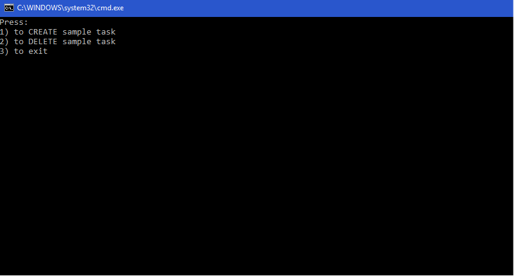

# TaskScheduler
Konzolová aplikace, která vytváøí plánované úlohy. Pracuje s Plánovaèem úloh OS Windows.

Plánovaè úloh je C# možné používat díky nuget balíèku **[TaskScheduler](https://www.nuget.org/packages/TaskScheduler/)**.
```csharp
using Microsoft.Win32.TaskScheduler;
```
```csharp
using (TaskService ts = new TaskService())
{ 
    // Settings
    TaskDefinition td = ts.NewTask();
    // Create
    ts.RootFolder.RegisterTaskDefinition(TaskName, td);
    // Or delete
    //ts.RootFolder.DeleteTask(TaskName);
}
```
---
Aplikace vytváøející úlohy se skládá z èástí:
* TaskSchedulerClient -> .Net Core konzolová aplikace
* TaskSchedulerLib -> .Net Standard knihovna ovládající Win32 TaskScheduler



## Použití
**Klientská èás�**:
1) Pøidat referenci na knihovnu TaskSchedulerLib do projektu
```csharp
using Utils.TaskSchedulerLib;
```
2) Vytvoøit instanci TaskManager -> tøídy knihovny, která obsluhuje úlohu
```csharp
TaskSchedulerManager taskSchedulerManager = new TaskSchedulerManager();
```
3) Vytváøení plánovaných úloh 
```csharp
// Scheduled task name
taskSchedulerManager.TaskName = "Scheduled task name";
// Action
taskSchedulerManager.SetExecAction("notepad.exe", "c:\\test.log", null);

taskSchedulerManager.CreateSampleTask();
```
4) Mazání vytvoøené úlohy
```csharp
taskSchedulerManager.DeleteSampleTask();
```